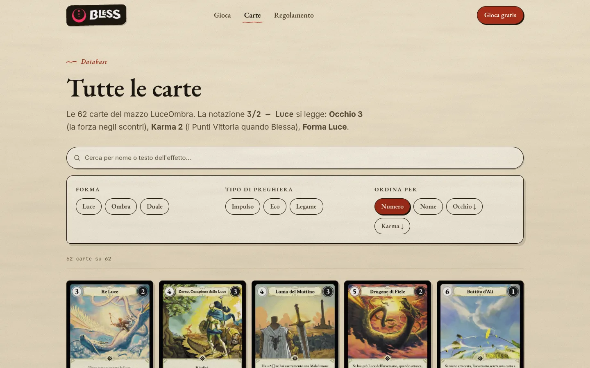
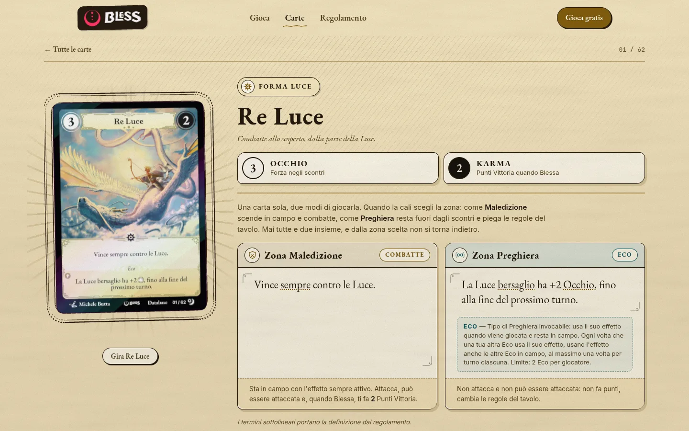
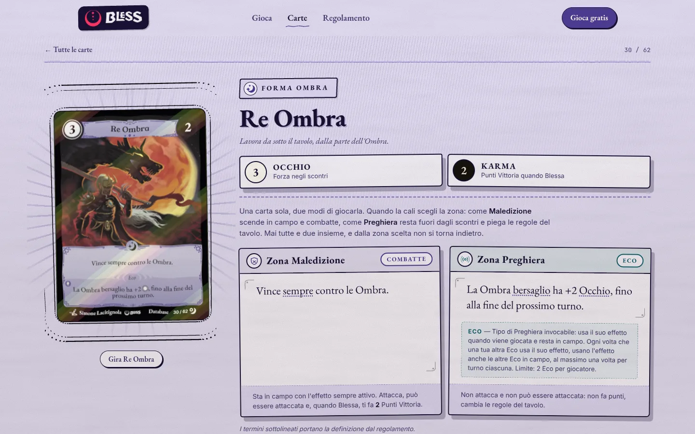
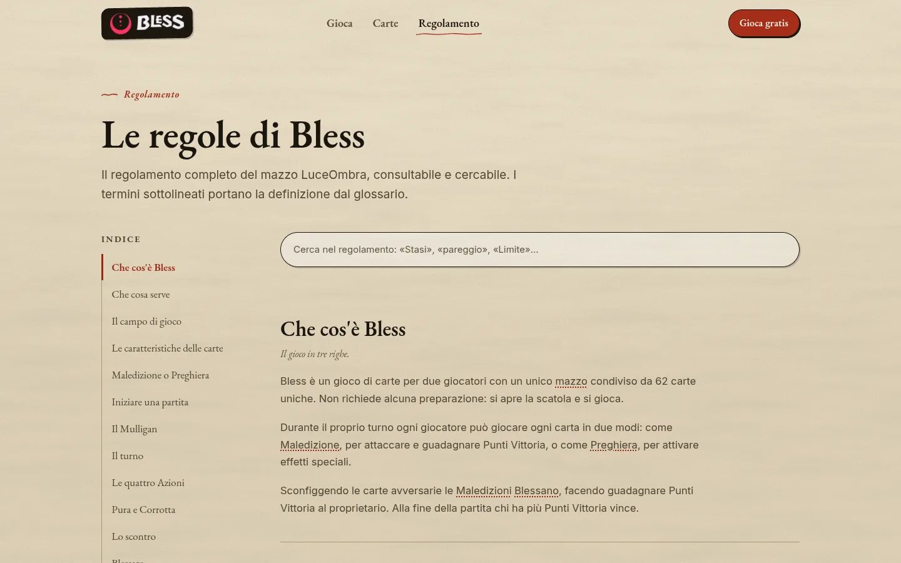
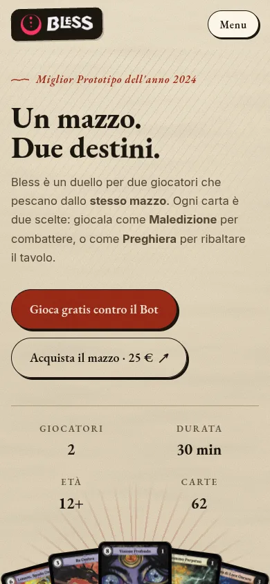

# Bless

Questo è un redesign del sito ufficiale di [Bless](https://blesscardgame.com),
il gioco di carte per due giocatori di Luminous Vine Studio.

L'idea era dare al sito lo stesso aspetto delle carte: fondo di pergamena,
tratti d'inchiostro, ombre piene al posto delle sfumature e i colori presi
direttamente dalle cornici. Tutto doveva sembrare disegnato a mano, non
impaginato.


## Cosa c'è dentro

**La home** presenta il gioco partendo dalle carte. Il ventaglio in alto si
può trascinare: basta lasciare una carta per aprirne la scheda, e a ogni
visita la mano cambia. Più in basso una carta in 3D mostra i due modi di
giocarla, come Maledizione o come Preghiera.

**Il database** raccoglie tutte e 62 le carte del mazzo LuceOmbra. Si possono
cercare per nome o per testo, filtrare per Forma e tipo di Preghiera e
ordinare per numero, nome, Occhio o Karma. I filtri finiscono nell'URL, così
una ricerca si può condividere com'è.



**Ogni carta ha la sua pagina**, e la pagina prende i colori della sua Forma:
oro e luce calda per Luce, lavanda e ombre storte per Ombra, terracotta e
tratteggio incrociato per Duale. La carta è renderizzata in WebGL con uno
shader a bande, un contorno a inchiostro e un foil diverso per ogni Forma.
Sotto c'è sempre l'immagine normale, quindi se WebGL manca non si rompe
niente.

| Luce | Ombra |
|---|---|
|  |  |

**Il regolamento** è tutto su una pagina, con indice, ricerca e glossario.
I termini di gioco, sia nel regolamento sia nel testo delle carte, mostrano la
definizione al passaggio del mouse (su telefono al primo tocco) e portano alla
voce del glossario.



Il sito è pensato anche per il telefono, fino a 320px di larghezza.

<p align="center">
  
</p>

## Com'è fatto

Next.js 15 con App Router, TypeScript e CSS Modules, senza librerie di UI.
Le animazioni usano [anime.js](https://animejs.com) e la carta 3D
[three.js](https://threejs.org). Tutti e due si caricano solo quando servono:
three arriva quando la carta sta per entrare nello schermo, anime.js solo
sulle pagine che hanno qualcosa da animare.

Le pagine sono tutte statiche. In build viene generata anche un'anteprima
1200×630 per ogni carta, da usare quando la si condivide sui social.

```
src/app/         le pagine
src/components/  i componenti (anim/ per anime.js, three/ per la carta 3D)
src/data/        carte, regolamento e glossario
src/lib/site.ts  nome, link, social e dati del prodotto
public/cards/    le illustrazioni delle carte
```

## Avviarlo in locale

```bash
npm install
npm run dev
```

Il sito è su http://localhost:3000. Per la build di produzione:

```bash
npm run build
npm start
```

## Cosa manca

- Il simulatore per giocare online è un'applicazione separata e non è in
  questa repo. Per ora `/gioco` è solo una pagina di presentazione.
- Privacy, cookie, termini e contatti ci sono, ma aspettano i testi veri.
  Fino ad allora restano fuori dall'indicizzazione.
