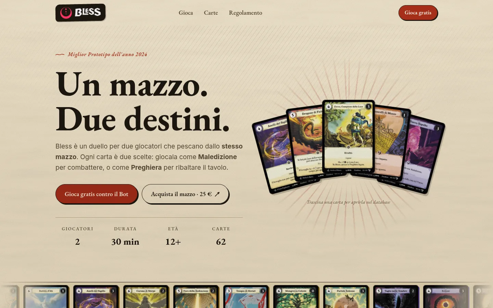

<h1 align="center">Bless</h1>

<p align="center">
  <em>Un mazzo. Due destini.</em><br>
  Il sito di Bless, il gioco di carte per due giocatori di Luminous Vine Studio,
  premiato come Miglior Prototipo dell'anno 2024.
</p>

<p align="center">
  <a href="https://blesscardgame.com"><strong>blesscardgame.com</strong></a>
</p>



## Il progetto

Un sito pensato per somigliare al gioco che racconta. La pergamena, i tratti a
inchiostro e i colori sono quelli delle carte, così il sito sembra fatto con
gli stessi materiali del mazzo.

Il sito accompagna il giocatore dalla prima scoperta alla partita:

- **Le carte.** Il catalogo completo del mazzo, da cercare e filtrare. Ogni
  carta ha una sua pagina, che prende i colori della sua Forma.
- **Il regolamento.** Tutte le regole in una sola pagina. Il glossario spiega
  ogni termine di gioco nel punto esatto in cui compare.
- **La partita.** Si sceglie il mazzo e si gioca subito contro il Bot, oppure
  si invita un amico con un link.

Il sito è curato in ogni dettaglio: veloce, accessibile e pensato per il
telefono quanto per il desktop.

## Sviluppo

Realizzato con Next.js e TypeScript.

```bash
npm install
npm run dev
```

---

<p align="center">
  <sub>Bless è un gioco di <a href="https://luminousvinestudio.com">Luminous Vine Studio</a>.</sub>
</p>
